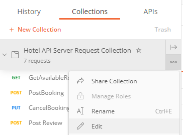
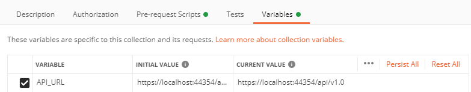

<h1> Hotel Web Template</h1>
<h2>Kurs Producera och leverera mjukvara</h2>


<h2>Grupp 1</h2>

Medverkande i grupp 1 är Aron Cederlund, Ted Henriksson, Pierre Nygård, Samir Ehsani, Fredrika Eriksson, Mirko Pralica, Adam Martinsson, Dimitris Nasis, Gita Frankus, Johan Käll, Shipra Sharma och Julian Rzodkiewicz

<h2>Tanken bakom projektet</h2>

**Hotel Web Template** är en webbplats där man kan boka och avboka rum på ett hotel. Man ska kunna välja antal gäster, datum för in- och utcheckning,  vilka rum som ska bokas samt tillval till rummet och bokningen överlag såsom frukost, spa tillgång med mera. 

Man ska också kunna läsa och skriva recensioner för hotellet och hotellets restaurang. 

Fokus under projektet ligger på funktionalitet och säkerhet för hotellbokning och avbokning, samt dataintegritet och åtminstone en grundläggande design för Appen.

<h2>Tech stack</h2>

#### Client Projekt
Client är vår Frontend och är byggd med **Blazor WebAssembly** som kommunicerar med vår API genom HTTPS. 

#### Server Projekt
Server är ett **.Net 5.0 core** API som hämtar och lagrar data i vår relationsdatabase som hostas på Azure. 

#### Test Projekt
Det är en Xunit projekt som innehåller enhetstester för vår API.

#### Shared Bibliotek
Shared är ett klassbibliotek som innehåller alla vår modeller och DTO:er. Vi har byggt en Nuget package baserad detta klassbibliotek för att dela modeller och DTO:er mellan olika projekter.

<h2>Branching strategi</h2>
För utveckling och test staging använder vi en branch Development. Commits till Development triggar en CI/CD pipeline som updaterar en development live server av applikationen. 

Vid slutet av Sprints, eller vid överrenskommelse från gruppen mergas Development in till Main. 

Branches är namngivna antingen efter Jira story eller, om tillgängligt, sub tasks ifrån storyn.  Pull Requests mot Development skall ha samtliga utvecklare som reviewers och givet att det inte finns Change Requests så behöver den vara godkänd av 2 personer innan merge.

<h2>Användning av projektet</h2>

För att starta upp projektet lokalt så behöver man bygga upp en appsettings.Development.json med ConnectionStrings och DefaultConnection riktad mot en Sql Server. Denna fil ska ligga inuti Hotel.Server.

```json
{
  "Logging": {
    "LogLevel": {
      "Default": "Information",
      "Microsoft": "Warning",
      "Microsoft.Hosting.Lifetime": "Information"
    }
  },
  "AllowedHosts": "*",
  "ConnectionStrings": {
    "DefaultConnection": "Connection_String"
  }
}
```

För att kunna skicka och ta emot email behöver man lägga till detta i sin appsettings.Development. EmailUsername samt EmailPassword håller credentials till avsändaren och behöver således fyllas i personligen. 

```json
"EmailService": {
    "EmailUsername": "",
    "EmailPassword": "",
    "EmailSmtpHost": "smtp.gmail.com",
    "EmailSmtpPort": 587
  }
```

Stega in i Hotel.Server/, öppna package-manager console och gör en migration. 

```
dotnet ef migrations add "Name_Migrations"
```

Uppdatera sedan databasen med <a href="https://docs.microsoft.com/en-us/ef/core/cli/dotnet">Ef tools</a>.

```
dotnet ef database update
```

Ifrån solution, välj multiple startup projects (Hotel.Server, Hotel.Client) och kör igång!

<h2>Hotel Api</h2>

### Dokumentation

Swagger används som dokumentation av vårat server API.

Dokumentationen går att nå genom att bygga och köra API:et i en docker container i development mode. Första steget är att ställa sig i rotmappen för projektet och bygga en image genom detta kommando:

```powershell
docker build -t hotelapi ./Hotel.Server
```

Därefter köra containern med följande kommando.

```powershell
docker run -d -p 8080:80 --name hotelapi --env ASPNETCORE_ENVIRONMENT=Development hotelapi
```

När det är gjort ska det gå att nå dokumentationen på: 
http://localhost:8080/swagger/index.html

### Postman API Requests

Det finns en Postman API Request Collection fil som innehåller requests till alla våra CRUD-funktioner som enkelt kan importeras och köras i Postman.

[Postman API Request Collection](https://github.com/PGBSNH19/project-grupp-1-hotel/blob/development/Documentation/PostmanAPIRequestCollection/Hotel%20API%20Server%20Request%20Collection.postman_collection.json)

Det kan behövas att sätta *Collection Variable* "API_URL" till din lokala URL om den skulle skilja sig, det kan göras genom att klicka på Edit.

 


Därefter gå in på Variables ändra *API_URL*, ändra både *INITIAL VALUE* och *CURRENT VALUE*. 

 


<h2>Övriga resurser och länkar</h2>

- <a href="Documentation/BDD.md">Länk till BDD dokument</a>
- <a href="https://plushogskolan.atlassian.net/jira/software/c/projects/G1/pages">Övrig dokumentation på Confluence</a>
- <a href="https://pgbsnh19.github.io/course-producera-leverera/assignments/project">Länk till projekt</a>
